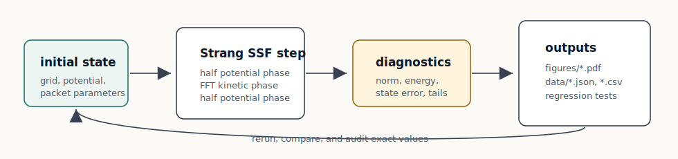
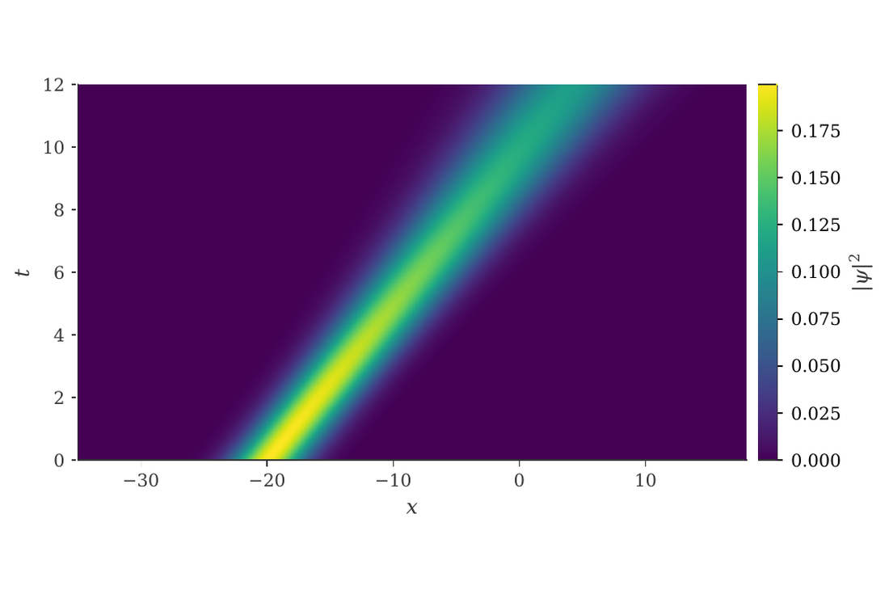
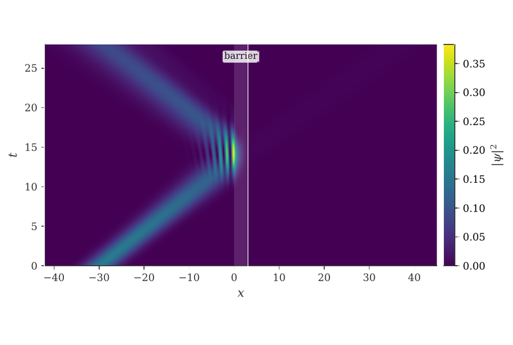
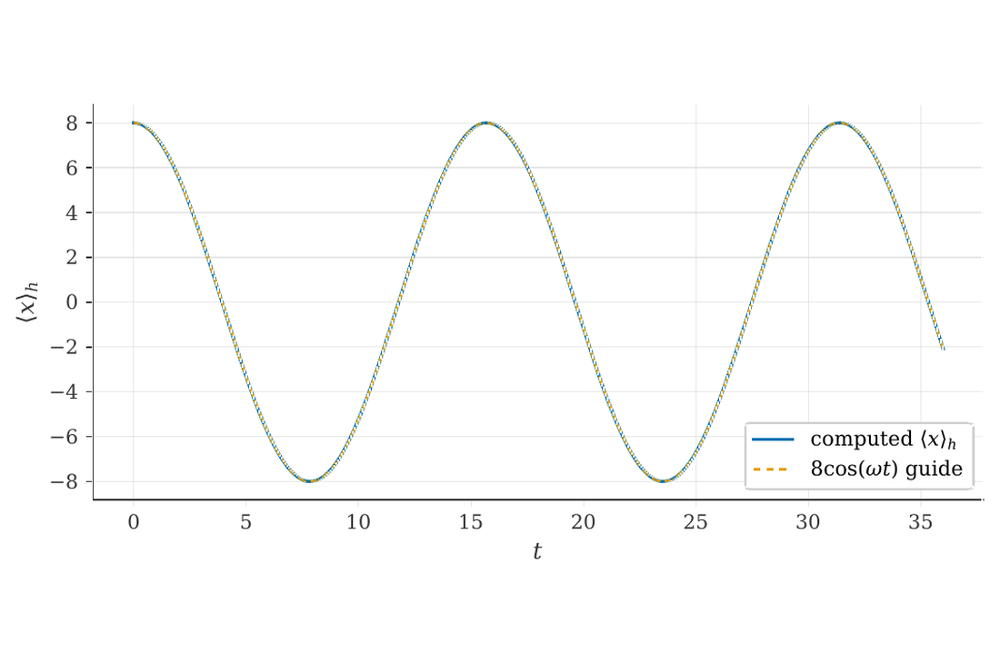
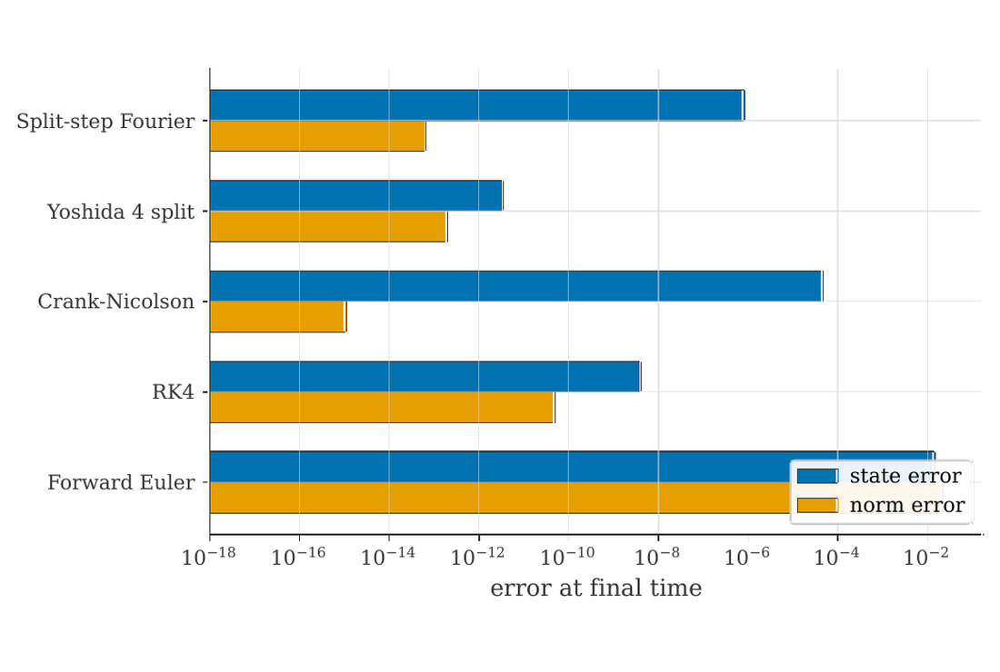
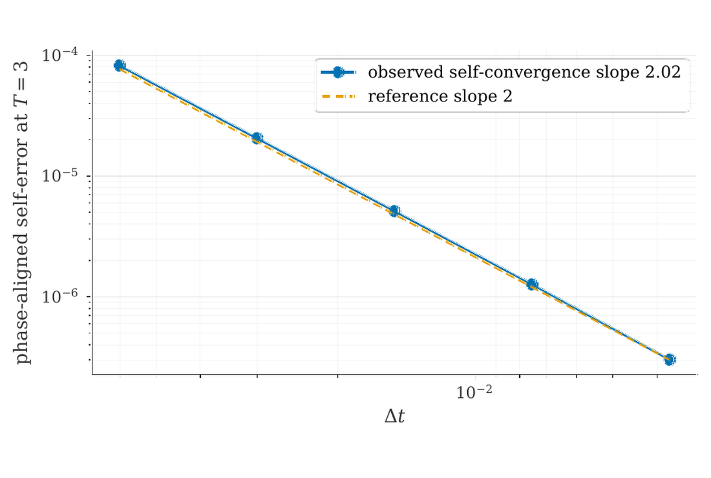
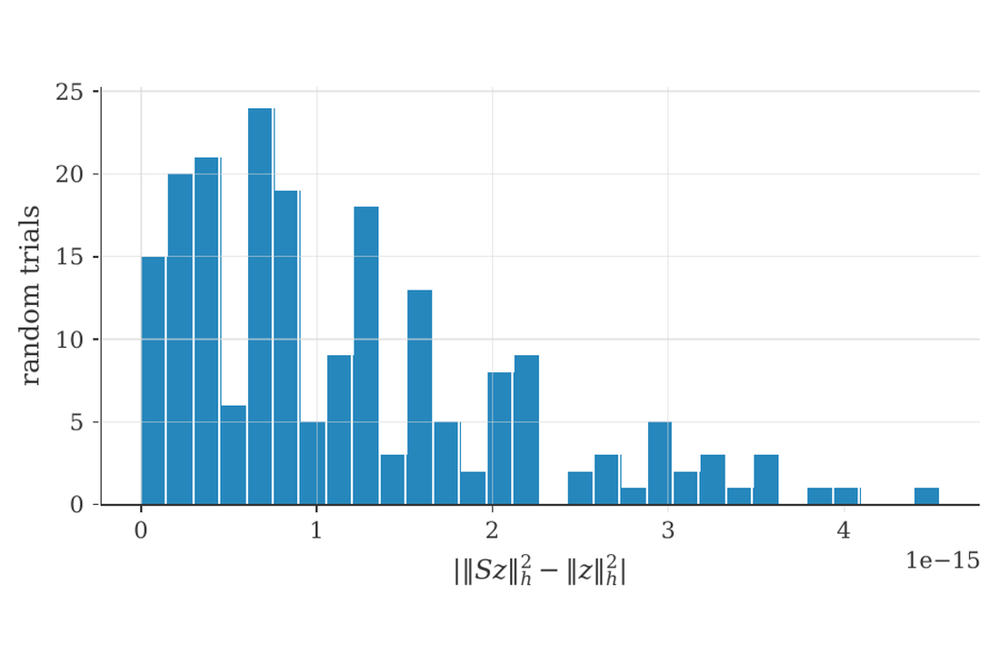

# Split-Step Fourier Diagnostics

Numerical experiments for a one-dimensional split-step Fourier solver for the time-dependent Schrödinger equation.

This repo is intentionally just the reproducibility side: Python code, generated data, regression tests, and result figures. It does not include the paper source, LaTeX build files, or private submission notes.



## What is here

The code studies the Strang split-step Fourier update on a periodic grid with a normalized FFT. The central check is simple but important: when the sampled potential is real and the FFT normalization is unitary, the update is a product of unitary operations. That means probability should be preserved up to floating-point error. The experiments then ask the more useful follow-up questions: where is the solution accurate, where do boundary effects show up, and how do other propagators behave under the same diagnostics?

The repository contains:

```text
.
├── generate_figures.py          numerical experiments and figure generation
├── test_numerics.py             regression checks for core numerical behavior
├── data/                        generated JSON, text, and CSV summaries
├── figures/                     vector PDF outputs
├── assets/readme/               PNG previews used in this README
├── .github/workflows/tests.yml  CI smoke checks
├── requirements.txt
├── requirements-lock.txt
└── environment.yml
```

## Result gallery

The images below are generated from the checked-in figure outputs. The PDF versions live in `figures/`.

<table>
  <tr>
    <td width="50%">
      
      <br>
      <sub>Free Gaussian propagation. This is the clean reference case: a resolved packet moving on a periodic grid.</sub>
    </td>
    <td width="50%">
      
      <br>
      <sub>Finite barrier scattering. The diagnostics separate transmitted mass, reflected mass, and boundary-tail mass.</sub>
    </td>
  </tr>
  <tr>
    <td width="50%">
      
      <br>
      <sub>Harmonic oscillator center trajectory. The finite periodic box is treated as a modeling approximation and checked with tail diagnostics.</sub>
    </td>
    <td width="50%">
      
      <br>
      <sub>Method comparison. Unitary methods control norm drift; state error still depends on the method and step size.</sub>
    </td>
  </tr>
  <tr>
    <td width="50%">
      
      <br>
      <sub>Temporal self-convergence. The observed slope is about second order, as expected for Strang splitting.</sub>
    </td>
    <td width="50%">
      
      <br>
      <sub>Explicit finite-dimensional matrix check. The measured unitarity defect is at roundoff scale.</sub>
    </td>
  </tr>
</table>

## Headline diagnostics

These values come from `data/results_summary.json`, which is the best place to audit exact output.

| Diagnostic | Current value |
| --- | ---: |
| Free packet max norm error | `3.305133944309091e-13` |
| Free packet full-state error | `3.958179842672649e-12` |
| Free packet max center error | `1.5116796703296131e-12` |
| Barrier transmitted mass | `0.04584802956943435` |
| Barrier spectrum-weighted transmission estimate | `0.045731053013186716` |
| Barrier boundary-tail mass | `0.0316741090225629` |
| Harmonic oscillator max norm error | `6.514788708500419e-13` |
| Harmonic oscillator max center error | `7.55860934482655e-05` |
| Long-time norm error over 12000 steps | `2.2341017924532025e-12` |
| Temporal convergence slope | `2.020702491197738` |
| Explicit DFT unitarity Frobenius defect | `1.0427091626200353e-13` |
| Forward Euler final norm in comparison run | `1.0732062337132835` |

## Experiments

`generate_figures.py` can run the full suite or a single experiment.

| Experiment key | What it checks |
| --- | --- |
| `free` | analytic Gaussian propagation, moments, tail mass, and full-state error |
| `barrier` | square-barrier scattering, transmitted/reflected mass, spectral estimate, and boundary tails |
| `harmonic` | oscillator center motion, variance, energy drift, and domain-tail behavior |
| `norm_comparison` | split-step norm preservation against forward Euler and RK4 |
| `method_comparison` | SSF, Yoshida fourth order, Crank-Nicolson, RK4, and forward Euler on the same state |
| `convergence` | temporal self-convergence |
| `spatial_convergence` | spatial resolution against a high-resolution reference |
| `long_time_norm` | norm drift over a long closed-system run |
| `unitarity_defect` | explicit small-matrix unitarity defect |
| `time_reversal` | forward-then-backward recovery |
| `precision_sensitivity` | complex128 versus stored complex64 behavior |

## Setup

Python 3.11 or newer is recommended.

Using `pip`:

```bash
python -m venv .venv
python -m pip install -r requirements.txt
```

For an exact local environment snapshot, use `requirements-lock.txt`.

```bash
python -m pip install -r requirements-lock.txt
```

Using `conda`:

```bash
conda env create -f environment.yml
conda activate ssf-paper
```

## Reproduce the outputs

Full run:

```bash
python generate_figures.py --root .
```

Quick smoke run:

```bash
python generate_figures.py --root . --quick
```

Single experiment:

```bash
python generate_figures.py --root . --experiment method_comparison
```

The full run refreshes:

- `figures/*.pdf`
- `data/results_summary.json`
- `data/results_summary.txt`
- `data/time_convergence.csv`
- `data/spatial_convergence.csv`

The script does not write manuscript helper TeX files by default. There is a `--write-tex` switch for private manuscript workflows, but this repository is meant to stay focused on code and inspectable numerical outputs.

## Tests

Run:

```bash
python test_numerics.py
```

The checks cover:

- norm preservation for the split-step update
- norm preservation for the fourth-order Yoshida composition
- norm growth for forward Euler on a generic state
- global phase alignment
- normalized DFT unitarity
- time-reversal recovery
- square-barrier transmission bounds
- consistency of the barrier spectral breakdown
- harmonic ground-state width stability
- stored complex64 update shape and dtype behavior

GitHub Actions runs these checks on Python 3.11 and 3.12, followed by a quick generation smoke test.

## Notes on interpretation

Unitarity is not the same thing as accuracy. The split-step update can preserve norm while still showing phase error, boundary artifacts, or insufficient resolution. That is why the repository keeps several diagnostics side by side instead of relying on a single conservation plot.

The experiments use dimensionless units and periodic grids. Boundary-tail diagnostics are included because periodic boxes are a numerical model, not the infinite line.

## Citation

If you use the code or generated diagnostics, cite this repository. Citation metadata is provided in `CITATION.cff`.
